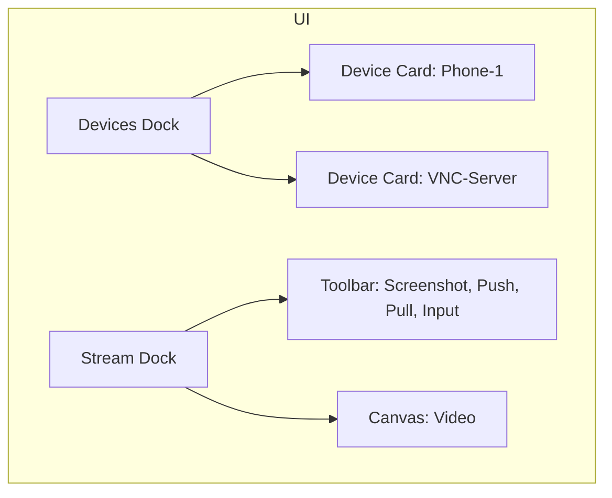

# Phase 2 — Device Support (Android Wi‑Fi & VNC)

Status: draft

Overview
--------
Phase 2 adds device inspection and remote control capabilities to SikuliPy. The initial targets are:

- Android devices over ADB/Wi‑Fi using `adb` + `scrcpy` (video + input).
- Generic remote desktops via VNC (view + input forwarding).

Goals
-----
- Allow developers to view device screens inside SikuliPy and perform interactions (tap/click, drag, keyboard) from the IDE.
- Provide easy connection/pairing flows and a device list UI.
- Support file transfer (push/pull) for assets and screenshots.
- Keep the integration lightweight: prefer existing, well‑maintained binaries (`adb`, `scrcpy`) and standard Python libs for VNC.

Non‑Goals (Phase 2 scope limits)
--------------------------------
- Full device management (install/uninstall apps) — only minimal file transfer and input injection.
- Deep UI introspection (no direct accessibility tree integration) — later phases may add `uiautomator2` or similar.

High‑level architecture
-----------------------
- UI Layer (Qt): Devices dock, Streaming view (Qt widget), connection dialogs.
- Bridge/Controller: Python processes that manage external binaries and client libraries.
  - Android bridge: spawns `adb` commands and `scrcpy` process; reads video frames into Qt surface (via scrcpy preferring --windowless or using an SDL output wrapper) or receives frames via ffmpeg socket.
  - VNC bridge: uses a Python VNC client library that renders into a Qt widget and forwards input events to the VNC server.
- Settings: `sikulipy_config.py` additions for `ADB_PATH`, `SCRCPY_PATH`, VNC defaults, timeouts.

Dependencies & binaries
----------------------
- Required (recommended):
  - `adb` (Android SDK platform-tools) — required for Android device discovery and connecting over Wi‑Fi.
  - `scrcpy` — recommended for high-performance streaming and input forwarding.
- Optional Python libs:
  - `python-vnc-viewer` or `vncdotool` / `pyVNC` implementations — for VNC client capabilities.
  - `asyncio`, `pyqt` integration utilities.

Security considerations
----------------------
- VNC: support basic username/password; avoid storing plain credentials by default — prompt per session or allow encrypted storage behind user choice.
- ADB over Wi‑Fi: inform user to enable ADB over TCP only on trusted networks.

User Flows
----------
1. Add / Connect Android device (USB or Wi‑Fi):
   - User opens `Devices` dock and clicks `+` → `Connect Android`
   - Dialog: `Detect devices (adb)`, `Connect by IP` (ip:port), `Start scrcpy stream` toggle.
   - User chooses device and clicks `Connect` → IDE runs `adb connect` (if needed) and launches `scrcpy` with parameters.
   - Streaming view opens as a docked widget. Actions: `Tap`, `Drag`, `Keyboard`, `Screenshot`, `Push File`, `Pull File`.

2. Add / Connect VNC host:
   - `+` → `Connect VNC` → enter `host:port`, optional credentials, `Connect`.
   - A VNC client instance is created and the stream is rendered in the Devices dock.
   - Actions: `Mouse`, `Keyboard`, `Screenshot`, `File Transfer` (if VNC extension supports) or via separate SCP/SMB flow.

3. Capture / Screenshot flow from device view:
   - User clicks `Screenshot` on device toolbar → stream frozen, save dialog (like capture flow) shown in IDE, file saved to project `assets/devices/`.

4. Disconnect / Stop stream:
   - Stop button kills `scrcpy` or disconnects VNC client and cleans resources.

UI Mock (wireframes)
--------------------
- Devices Dock (left/side dock):
  - Header: `Devices` [+ Connect]
  - List of device cards (rows) with status badge (online/streaming), name, model, connect button
  - Right-click actions: `Connect`, `Disconnect`, `Open Stream`, `Remove`.

- Device Stream Dock (main content area or separate dock):
  - Top toolbar: `Screenshot`, `Rotate`, `Scale`, `Send Text`, `Push File`, `Pull File`, `Full Screen`, `Stop`
  - Stream canvas: live video (Qt widget) sized to fit, supports mouse events mapped to device coordinates
  - Bottom status bar: resolution, framerate, connection latency

Mermaid mock (layout):

Coordinate mapping / Input forwarding
------------------------------------
- Map Qt widget pixel coords → device coords accounting for scale, rotation and device DPR.
- For Android via `scrcpy`: forward mouse events to `scrcpy` which injects input.
- For VNC: inject mouse/keyboard events via the VNC client library.

Implementation options (detailed)
--------------------------------
1) Lightweight, fast (recommended): `adb` + `scrcpy` subprocess
   - Launch `scrcpy` with `--shortcuts` disabled and `--window-title` set. Use `--max-size` and `--prefer-text` as needed.
   - Capture scrcpy window frames into Qt by:
     - Option A: Use scrcpy's `--output` (if available) or an ffmpeg pipe (scrcpy can pipe video to stdout with `-` if compiled with ffmpeg) and decode frames into QPixmap.
     - Option B: Use scrcpy SDL window as external process and embed via window handle (platform-dependent, use `QWindow.fromWinId(hwnd)` on Windows).
   - Pros: best latency, robust input; Cons: requires scrcpy binary installed.

2) Pure Python (VNC + remote adb implementations)
   - For VNC, use a Python VNC client that renders to a Qt widget (e.g., `pyvnc` / `vncdotool` + custom QImage rendering).
   - For Android, `minicap` + `minitouch` could be used on device with a Python bridge; more complex.

3) Hybrid: `scrcpy` for Android; Python VNC for remote desktops.

File layout additions
---------------------
- `src/sikulipy/devices/` — controllers and bridge code:
  - `android_bridge.py` — start/stop adb, scrcpy, helper to map inputs
  - `vnc_bridge.py` — VNC client wrapper for Qt
  - `device_manager.py` — maintains device list, status, preferences
- UI additions: `src/sikulipy/gui/devices_pane.py` and `src/sikulipy/gui/device_stream.py`

Settings
--------
Add to `sikulipy_config.py`:
- `ADB_PATH` (default: `adb`), `SCRCPY_PATH` (default: `scrcpy`), `DEVICE_ASSETS_DIR` (default: `assets/devices`), `VNC_DEFAULT_PORT` (5900), timeouts and maximum stream resolution.

Acceptance criteria
-------------------
- User can connect to an Android device via IP and see its live screen inside SikuliPy.
- User can click/tap and send keyboard input to the connected Android device.
- User can connect to a VNC server and interact with its remote desktop.
- Screenshots and pushed files store under project assets and can be inserted into editor snippets.
- Connections cleanly disconnect and processes are terminated when user stops a stream.

Milestones & tasks
------------------
1. Spec (this document) and UX mock — done.
2. Research & decide binary/library choices (scrcpy + python-vnc) — 1 day.
3. Implement `device_manager` and `devices_pane` UI — 2 days.
4. Implement Android bridge (scrcpy spawn & embed) — 3 days.
5. Implement VNC bridge and stream widget — 3 days.
6. File transfer & input mapping tests — 2 days.
7. QA and multi-platform testing — 2 days.

Open questions
--------------
- Do we want to bundle `scrcpy` or require users to install it? (Recommend require install + docs.)
- Should we provide an SSH/SCP helper for file transfers to non‑Android devices behind VNC?

References
----------
- scrcpy: https://github.com/Genymobile/scrcpy
- adb docs: https://developer.android.com/studio/command-line/adb

---

Created: Phase 2 device spec. Next: I can scaffold the UI files (`devices_pane.py`, `device_stream.py`) and add `src/sikulipy/devices/android_bridge.py` stub. Reply with which stub you'd like first.